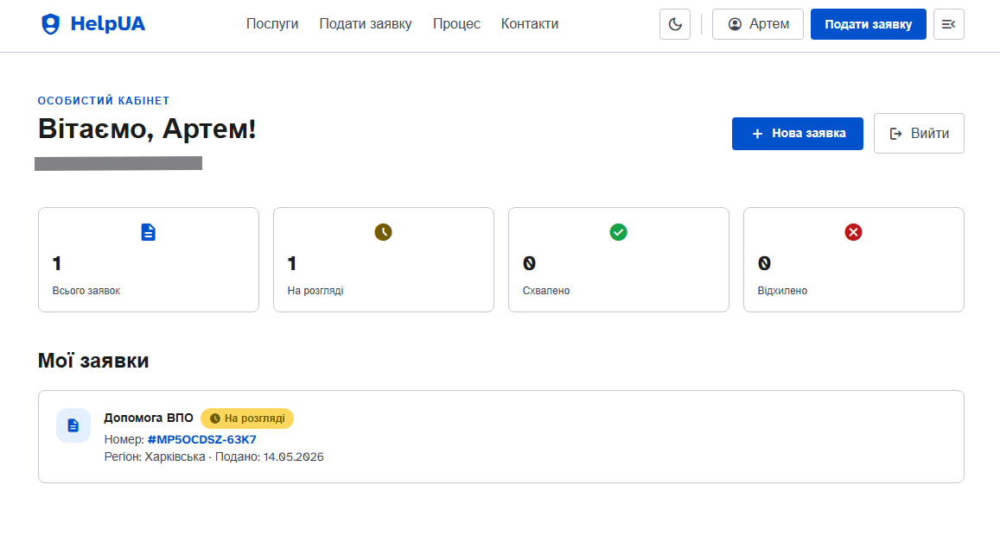
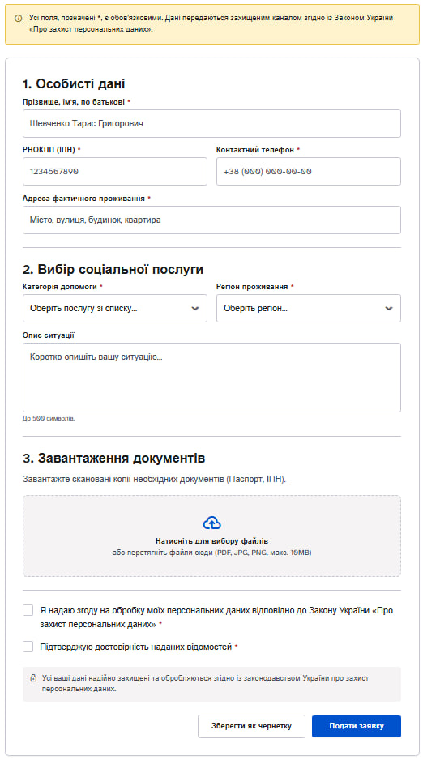
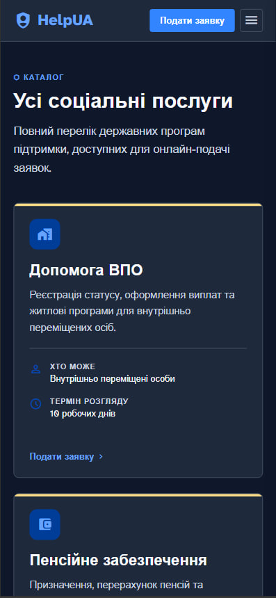
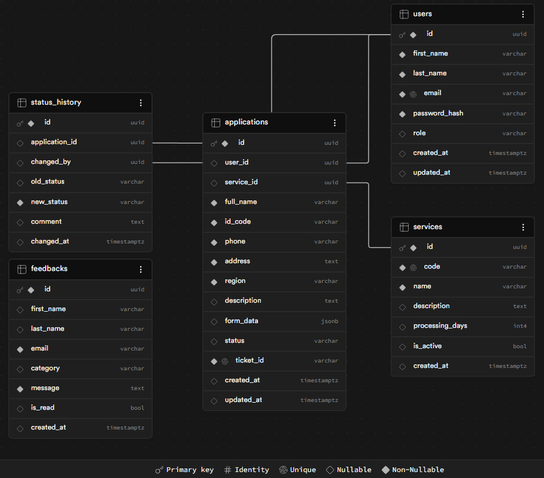

# HelpUA — Адаптивна вебсистема соціальних послуг

Дипломний проєкт зі спеціальності 121 «Інженерія програмного забезпечення».

## Про проєкт
HelpUA — це цифрова екосистема для автоматизації надання соціальних послуг. Проєкт вирішує проблему складного доступу до державних програм, пропонуючи прозорий механізм подачі заявок та моніторингу їх стану.

### Ключові екрани системи
<table>
  <tr>
    <th width="50%">Особистий кабінет</th>
    <th width="50%">Форма подачі заявки (Apply)</th>
  </tr>
  <tr>
    <td valign="top">
      
    </td>
    <td valign="top">
      
    </td>
  </tr>
</table>

### Адаптивність та Темний режим
Інтерфейс розроблено за принципом **Mobile-First**. Система автоматично адаптується під будь-які пристрої (смартфони, планшети, десктопи). Для зниження навантаження на зір та економії заряду пристроїв реалізовано повноцінну темну тему.

  

## Архітектура бази даних
Система використовує реляційну модель даних, побудовану на PostgreSQL (Supabase). Архітектура підтримує цілісність даних через систему зовнішніх ключів (Foreign Keys) та забезпечує аудит усіх змін статусів.

  

**Схема бази даних включає:**
- **Users:** Керування обліковими записами та ролями.
- **Services:** Каталог доступних соціальних програм.
- **Applications:** Центральна сутність для зберігання заявок.
- **Status_History:** Журнал аудиту для відстеження життєвого циклу заявки.
- **Feedbacks:** Модуль зворотного зв'язку.

> [!TIP]
> Повну структуру таблиць можна переглянути у файлі `schema.sql`.

## Безпека та захист персональних даних
Оскільки система працює з чутливими даними громадян (ПІБ, ІПН, адреси), у проєкті реалізовано багаторівневий підхід до безпеки:

1. **Автентифікація та Авторизація:** - Використовується механізм **JWT (JSON Web Tokens)**. 
   - Маршрути API захищені спеціальними middleware (`authMiddleware`), які перевіряють валідність токена перед наданням доступу до даних.
2. **Криптографія:**
   - Паролі користувачів ніколи не зберігаються у відкритому вигляді. Для їх хешування та перевірки використовується алгоритм **bcryptjs**.
3. **Валідація вхідних даних:**
   - На рівні бекенду реалізована сувора перевірка форматів даних (наприклад, регулярні вирази перевіряють, щоб РНОКПП містив рівно 10 цифр). Це захищає базу даних від "сміттєвої" інформації та SQL-ін'єкцій.
4. **Захист середовища:**
   - Усі секретні ключі (`JWT_SECRET`) та доступи до БД (`DATABASE_URL`) винесені у змінні середовища `.env` і не потрапляють до системи контролю версій.

## Стратегія розгортання (Deployment)
Для забезпечення стабільної роботи та швидкого оновлення системи використовується сучасна мікросервісна хмарна архітектура:

- **Frontend (Клієнтська частина):** Розгортається на платформі **Vercel**. Налаштовано CI/CD pipeline — кожен новий коміт у гілку `main` на GitHub автоматично запускає збірку (build) та оновлює сайт.
- **Backend (API Сервер):** Хоститься на платформі **Render** як вебсервіс Node.js.
- **Database (База даних):** Працює на хмарній інфраструктурі **Supabase** (PostgreSQL), що забезпечує автоматичне резервне копіювання та високу швидкість запитів.

## Технологічний стек
### Frontend
- React 18 + Vite
- Tailwind CSS
- Material Symbols (Google Icons)
- React Router DOM
- Atkinson Hyperlegible Next (шрифт для доступності)

### Backend
- Node.js + Express
- PostgreSQL (Supabase)
- JWT автентифікація
- bcryptjs

## Структура проєкту

    DIplomSite/
    ├── frontend/            # React SPA
    │   ├── src/
    │   │   ├── api/         # Функції для запитів до API
    │   │   ├── components/  # Спільні компоненти
    │   │   ├── context/     # AuthContext, AccessibilityContext
    │   │   └── pages/       # Сторінки застосунку
    ├── backend/             # Node.js REST API
    │   ├── src/
    │   │   ├── controllers/ # Бізнес-логіка
    │   │   ├── middleware/  # Auth, AdminOnly, Validate
    │   │   ├── routes/      # Маршрути API
    │   │   └── db/          # Підключення до БД та схема

## Запуск локально
### Вимоги
- Node.js 18+
- Акаунт Supabase

### Backend
    cd backend
    npm install
    # Створіть .env файл (див. .env.example)
    npm run dev

### Frontend
    cd frontend
    npm install
    npm run dev

## Доступність (WCAG 2.1 AA)
- [x] Skip-link для пропуску навігації
- [x] Видимий індикатор фокусу
- [x] ARIA-атрибути для форм та сповіщень
- [x] Контрастність тексту ≥ 4.5:1
- [x] Семантична HTML-розмітка
- [x] Темна тема
- [x] Шрифт Atkinson Hyperlegible Next

---
© 2026 HelpUA — Дипломний проєкт. Спеціальність 121 «ІПЗ»